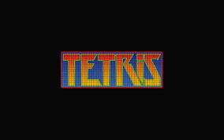
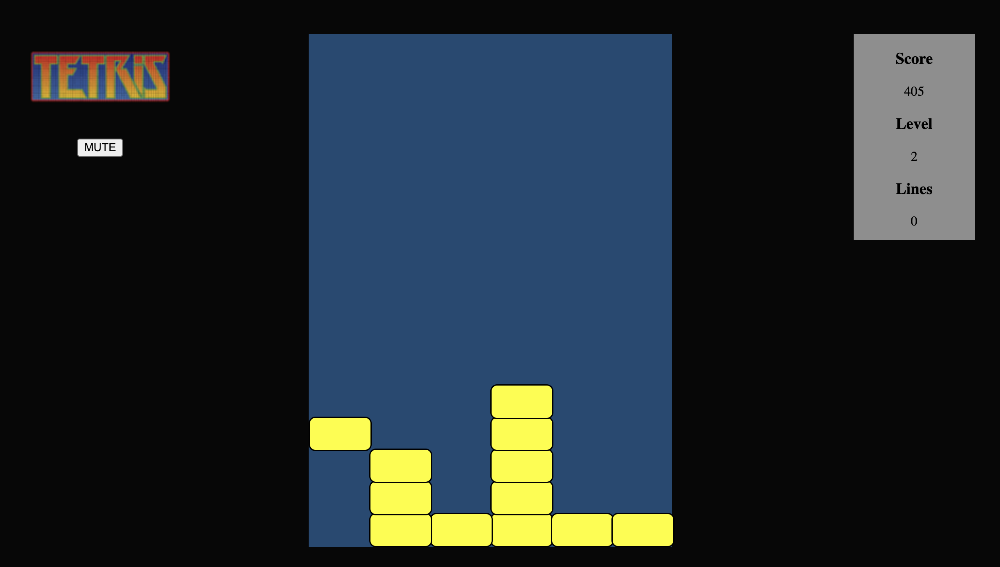
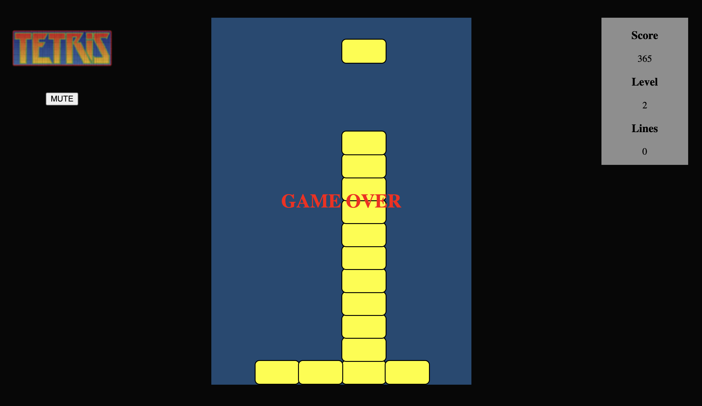
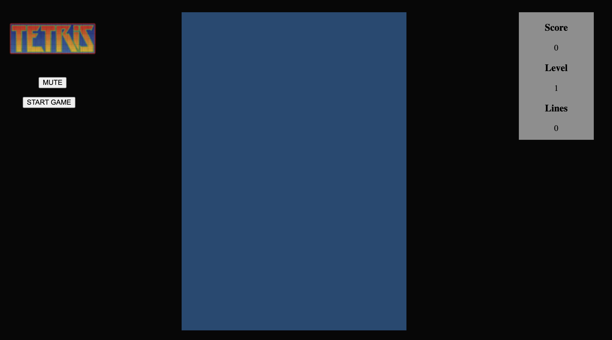

# **TETRIS**

## History

  Tetris is a surprising game. On paper, at least, it seems unlikely that   something so basic should have done so well beyond the year 1975.     Nevertheless, it’s been a consistently popular video game for decades.  It was invented in Russia, and it was never expected to be as popular    as it became.

 

## Goals

The aim in Tetris is simple; you bring down blocks from the top of the screen. You can move the blocks around, either left to right and/or you can rotate them. The blocks fall at a certain rate, but you can make them fall faster if you’re sure of your positioning. Your objective is to get all the blocks to fill all the empty space in a line at the bottom of the screen; whenever you do this, you’ll find that the blocks vanish and you get awarded some points.

 
A goal gives us a reason to play the game. Tetris offers an incredibly simple reason to play—pitting your wits against the computerized block dropper in order to last as long as you can.

 

## Rules

  Tetris has very simple rules: you can only move the pieces in specific ways; your game is over if your pieces reach the top of the screen; and you can only remove pieces from the screen by filling all the blank space in a line.

 

 

## How to play

- Click the "Start Game" button to start.
- Press space to pause.
- Keyboard controls:

  ← Moves left

  → Moves right

  ↓ Moves down (+5 score)

 

## Points

- +5 score after pressing the down
- Every 250 score, +1 level
- Every vanishing line, +1 level

<!-- # Milestone 1:

## display obstacle + obstacle can move left/righ

    [x] Create project structure (html, css, js)
    [x] Create repo + upload to GitHub

    [x] Class Game
        [x] start()
            x create an instance of the class Obstacles
            x draw it

    [x] Class Obstacle
        x position
        x size (w, h)
        x moveLeft()
        x moveRight()

        [x] Set Interval obstacle
            x add interval to obstacle that move downward every second

        [x] Move obstacle
            x event listener (key) + when obstacle presses, call move left/right

# Milestone 2:

    x stop first obstacle when reach to the bottom
    x add obstacles appearing in the UI
    x detect collision and redefine the position of obstacle
    x add a new obstacle when there is a collision
    x we detect if there's a collision in the starting line (Game Over)

    x Boundaries

# Milestone 3: make the game more interesting & fix bugs

    x create new obstacle in random position
    x Random positions
    x Clearing lines
    x Moving down objects after clearing
    - Change the obstacles shape

# Functionalities:

    - Shooting
    - Drop different things (prizes, different types of obstacles)
    x Count points
    x Improve game over
    x Levels
    - Multiple lives
    x Allow moving the player up and down
    - Random sizes for obstacles -->
